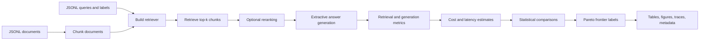

# Architecture

This repository implements a deterministic benchmark pipeline for evaluating
enterprise RAG configurations under retrieval quality, faithfulness, latency,
cost, and hallucination-risk objectives.

## Pipeline



The benchmark performs these steps:

1. Load documents from JSONL.
2. Load queries and relevance labels from JSONL.
3. Chunk documents using the configured token window and overlap.
4. Build the configured retriever.
5. Retrieve top-k chunks for each query.
6. Optionally rerank the candidate set.
7. Generate a deterministic extractive answer from retrieved context.
8. Compute retrieval metrics.
9. Compute generation and hallucination-risk proxy metrics.
10. Estimate component-level latency and cost.
11. Aggregate query-level metrics by variant.
12. Run paired statistical comparisons and confidence intervals.
13. Mark Pareto-optimal variants.
14. Write tables, figures, traces, and metadata.

## Retrieval modes

The default benchmark supports deterministic retrieval modes:

- `lexical`: cosine similarity over token-count vectors with IDF weighting.
- `hybrid`: lexical scoring plus phrase-overlap bonus.
- `dense_hash`: deterministic local hashing embeddings.
- `hybrid_dense_hash`: lexical score, dense-hash cosine score, and phrase overlap.

The default dense-hash path uses deterministic local embeddings. It does not use
Sentence Transformers, MiniLM, FAISS, hosted embeddings, or API keys.

Optional neural validation supports:

- `dense_neural`
- `hybrid_neural`

These modes require the optional Sentence Transformers dependency and are
configured separately in `configs/neural_embedding_validation.yaml`.

## Extractive generation

The benchmark uses deterministic extractive generation profiles. This isolates
retrieval, reranking, context selection, cost accounting, latency accounting, and
evaluation from hosted LLM nondeterminism. It is not intended to replace
production LLM evaluation.

## Cost and latency accounting

Cost and latency estimates are transparent configuration-driven estimates.
Component-level fields are written to query-level outputs:

- `retrieval_cost`
- `rerank_cost`
- `generation_cost`
- `total_cost`
- `retrieval_latency_ms`
- `rerank_latency_ms`
- `generation_latency_ms`
- `total_latency_ms`

The default constants are in `configs/default.yaml`.

## Pareto dominance

A configuration is dominated only if another configuration has:

- greater-or-equal `recall_at_k`;
- greater-or-equal `faithfulness`;
- lower-or-equal `total_latency_ms`;
- lower-or-equal `total_cost`;
- lower-or-equal `hallucination_risk`;
- and is strictly better on at least one of those objectives.

Pareto-optimality is computed within each experiment set. A Pareto-optimal
configuration is a non-dominated trade-off, not a universal winner.

## Outputs

The default run writes:

```text
results/default/
  tables/
  figures/
  traces/
  run_metadata.json
  final_result_summary.md
  v3_consistency_notes.md
```

The metadata includes environment information, the configuration, artifact
paths, and hashes.
